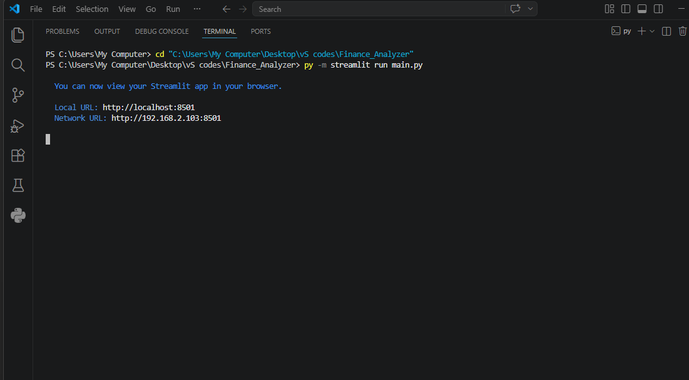
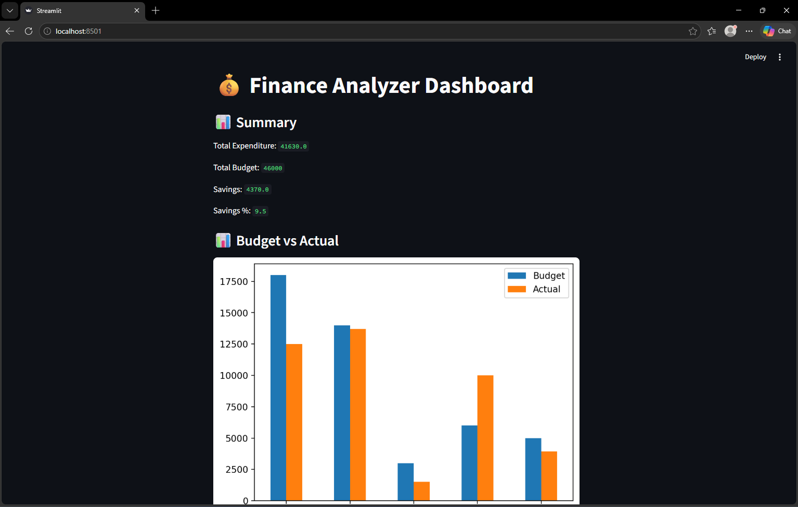
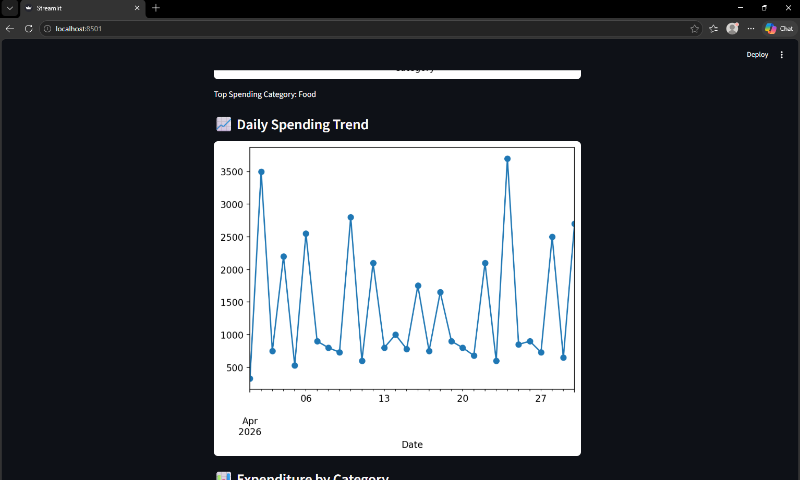
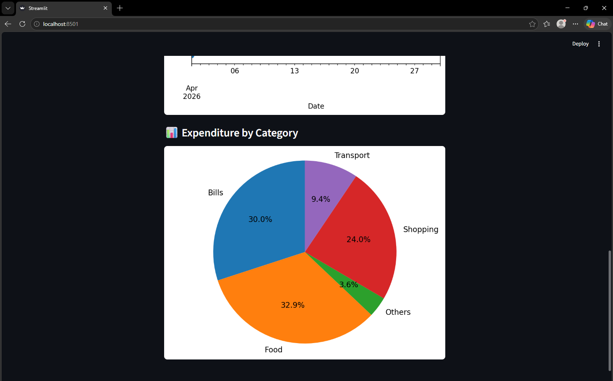

# Expenses_Analyzer_Streamlit

I have upgraded my expenses-analyzer and indulged in it an opensource python framework ***Streamlit*** tech to create an interactive app from the data scripts. 

---

## 🚀 Features

- Loads expense data from Excel
- Clean and preprocess data automatically
- Category-wise expense grouping
- Pie chart visualization of spending
- Simple Streamlit dashboard interface

---

## 🛠️ Tech Stack

- Python   
- Pandas   
- Matplotlib  
- Streamlit   
- OpenPyXL  

---

## 📁 Output 

## Author 
**MARYAM ZAHRA** (Electrical Engineering Graduate|Data and Power Systems Enthusiast)
